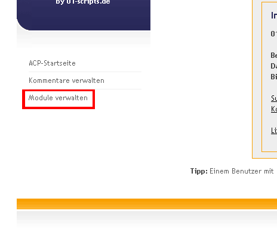
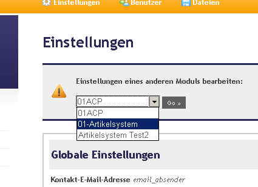
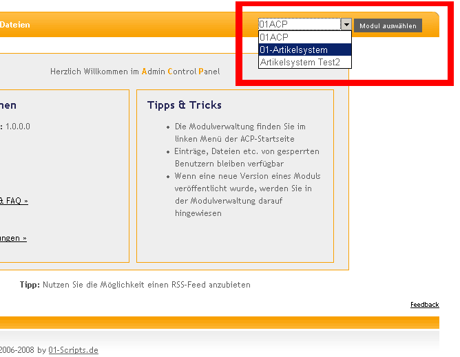
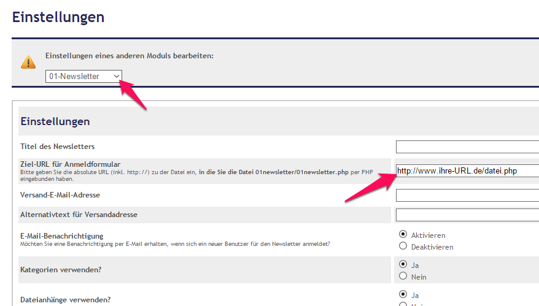
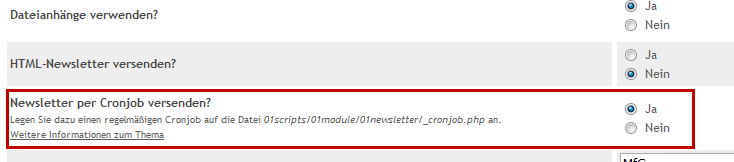
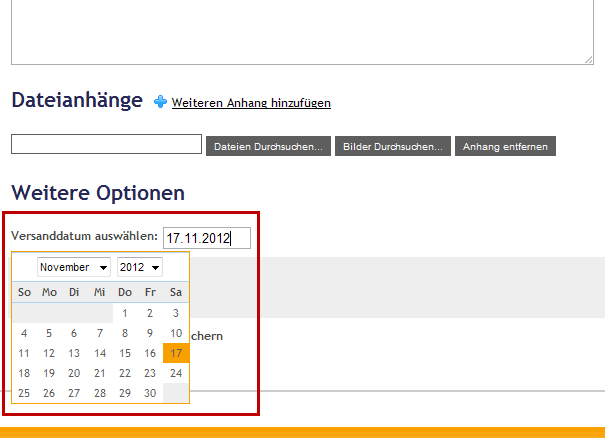
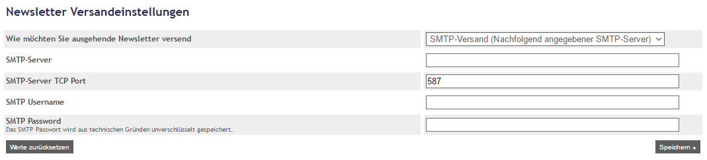
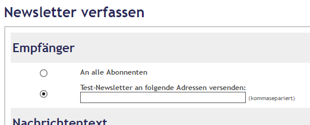
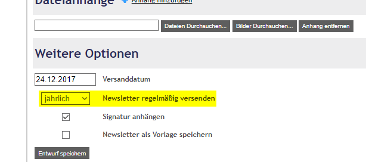
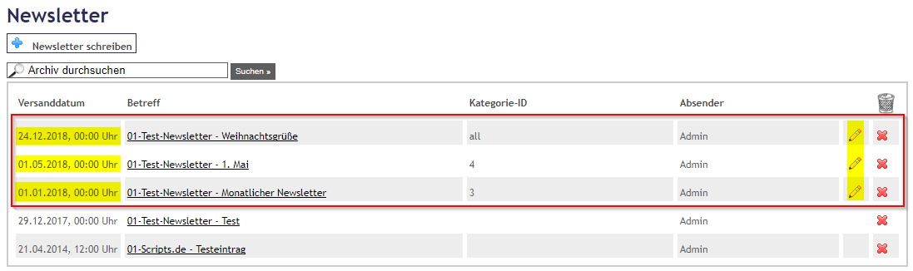

# 01-Newsletter

Mit dem  **01-Newsletterscript**  haben Sie die Möglichkeit schnell, einfach und sicher für ihre Besucher oder Kunden einen eigenen Newsletter anzubieten. Dabei müssen Sie die Daten Ihrer Abonnenten nicht mehr aus der Hand geben - alle E-Mail-Adressen bleiben auf ihrem eigenen Server gespeichert und können nicht von Dritten eingesehen werden.  
Starten Sie sofort und Im- und Exportieren Sie ihren bestehenden Empfängerkreis als CSV-Datei einfach in das  01-Newsletterscript!
  
Die komplette Verwaltung erfolgt - wie in allen aktuellen PHP-Scripten von  01-Scripts.de  - über das  [01ACP](https://github.com/01-Scripts/01ACP). Dort können Sie verschiedene Kategorien anlegen, aus denen ihre Besucher bei der Anmeldung auswählen.  
Selbstverständlich ist auch der Versand von Dateianhängen und Newslettern im HTML-Format möglich.  
Außerdem können Sie den Versand komfortabel per Cronjob zeitlich steuern und ihre Newsletter genau dann versenden, wann Sie es wollen! Auch regelmäßig wiederkehrende Newsletter sind damit möglich.  
Versenden Sie ihre Newsletter zuverlässige per SMTP-Versand. Dadurch kommen ihre Newsletter noch zuverlässiger ans Ziel und landen seltener im Spam-Ordner ihrer Empfänger. Für den Versand an eine große Anzahl an Empfängern lassen sich auch Dienste wie der  [Amazon Simple Email Service](https://aws.amazon.com/de/ses/)  verwenden.

Beim Verfassen von Newslettern können Sie Ihren Entwurf jederzeit zwischenspeichern und später daran weiterarbeiten. Außerdem haben Sie die Möglichkeit komplette Vorlagen zu erstellen, zu speichern und so ihre Newsletter noch schneller zu versenden. 
[Demo und weitere Informationen](https://www.01-scripts.de/downloads.php)

## Features

-   Versenden Sie schnell, komfortabel und einfach Newsletter an angemeldete Interessenten
-   Versenden Sie Dateianhänge und im HTML-Format
-   Zeitgesteuerter Versand per Cronjob und per SMTP möglich
-   Paternoster-Versand: Newsletter regelmäßig & automatisiert versenden
-   Nutzen Sie verschiedene Kategorien um Ihre Kunden noch gezielter anzusprechen
-   Im- und Export von Newsletter-Empfängern im CSV-Format
-   Mehr Sicherheit für Ihrer Abonnenten, da alle Daten auf Ihrem eigenen Server liegen!
-   [Double Opt-in-Verfahren](http://de.wikipedia.org/wiki/Opt-in)  zur Bestätigung einer gültigen E-Mail-Adresse
-   Legen Sie Vorlagen an und erstellen Sie zukünftige Newsletter noch schneller!
-   kostenlos (CC BY-NC-SA-Lizenz)

## Download

Die jeweils aktuellste Version des 01-Newsletter kann unter
[https://www.01-scripts.de/down_zip.php?godownload=1&01newsletter=1&01acp=1](https://www.01-scripts.de/down_zip.php?godownload=1&01newsletter=1&01acp=1)
heruntergeladen werden.

Einzelne Update-Pakete für alle veröffentlichten Updates sind hier zu finden:
[https://www.01-scripts.de/downloads.php](https://www.01-scripts.de/downloads.php)

## Installation

### Den Administrationsbereich (01ACP) installieren

Um einzelne Module wie das [01-Artikelsystem](https://github.com/01-Scripts/01-Artikelsystem) oder die [01-Gallery](https://github.com/01-Scripts/01-Gallery) zu installieren, muss zuerst einmalig der für alle Module benötigte Administrationsbereich (das [01ACP](https://github.com/01-Scripts/01ACP)) installiert werden:

#### Dateien hochladen

Entpacken sie das heruntergeladene .zip-Archiv in einen beliebigen Ordner auf ihrer lokalen Festplatte.  
Im Verzeichnis  `Administrationsbereich/`  finden sie das Verzeichnis  `01scripts/`  das alle Dateien zur Installation des 01ACP enthält.  
Laden sie das gesamte  `01scripts/`-Verzeichnis mit ihrem  FTP-Programm  in das Hauptverzeichnis ihrer Internetseite hoch. Achten sie dabei unbedingt darauf, dass die Datei- und Verzeichnisstruktur erhalten bleibt!  
  
Im Idealfalls sollte sich nach dem Hochladen der Daten das Verzeichnis  `01scripts/`  auf der gleichen Verzeichnisebene befinden wie ihre Index- oder Startdatei (meist index.php).

#### Installation des 01ACP starten

Nachdem sie alle Dateien auf ihren Webspace hochgeladen haben rufen sie in ihrem Browser bitte folgende Internetadresse auf:  
`http://www.ihre-domain.de/01scripts/01acp/install.php`  
  
Falls sich das Verzeichnis  `01scripts/`  **nicht**  im Hauptverzeichnis ihrer Internetseite befindet, müssen sie den Pfad der URL entsprechend anpssen:  
`http://www.ihre-domain.de/pfad-zum-script/01scripts/01acp/install.php`  
  
Sie werden anschließend mit der Installationsroutine durch die weitere Installation des 01ACP geführt. Folgen sie dazu einfach den Anweisungen auf dem Bildschirm.

#### Module installieren

Nachdem sie das 01ACP erfolgreich installiert haben und den ersten Benutzer-Account angelegt haben löschen sie bitte aus Sicherheitsgründen die beiden Dateien install.php und install_sql.php!  
Anschließend loggen sie sich bitte mit ihrem Admin-Account den sie bei der Installation angelegt haben, in den Administrationsbereich ein:  
`http://www.ihre-domain.de/01scripts/01acp/index.php`

### Module in das 01ACP installieren

Für die weiteren Schritte muss das 01ACP bereits installiert sein!

#### Modul-Verzeichnis hochladen

Wenn sie es noch nicht getan haben, dann entpacken sie das von  01-Scripts.de  heruntergeladene .zip-Archiv in einen beliebigen Ordner auf ihrer lokalen Festplatte.  
Im Verzeichnis  `Module/`  finden sie das von ihnen heruntergeladene Modul in einem Verzeichnis.  
Laden sie das Verzeichnis (z.B.  `01article/`) mit ihrem  FTP-Programm  in folgendes Verzeichnis:  
`/pfad-zum-script/01scripts/01module/`

#### Hochgeladenes Modul installieren

Loggen sie sich nun mit ihrem Admin-Account in das 01ACP ein.  
Nach dem Login finden sie im linken Menü der 01ACP-Startseite den Menüpunkt _Module verwalten_  klicken sie auf ihn.



In der erscheinenden Tabelle werden alle vorhandenen Module aufgelistet. Mit einem Klick auf den grünen Plus-Button starten sie die Installation des gewünschten Moduls.  
Geben sie einen Installationsnamen für das Modul an.  
Nach der Installation steht das Modul sofort zur Verfügung. In den Einstellungen können nun die Einstellungen für das installierte Modul vorgenommen werden.



Die Startseite des Moduls rufen sie über die Drop-Down-Box oben rechts im 01ACP auf:



### 01-Newsletter per PHP einbinden

Das 01-Newsletterscript ist darauf ausgelegt per PHP mit dem include()-Befehl in eine bestehende Seite eingebunden zu werden. Es wird dringend empfohlen diese Methode zu verwenden! Der Befehl dafür lautet folgendermaßen:

```php
<?PHP
$subfolder  = "01scripts/";         // Unterverzeichnis
$modul      = "01newsletter";       // Modul- und Verzeichnisname (=ID-Name)
                                    // ggf. ändern
 
// Hier ggf. weitere Parameter einfügen
 
include($subfolder."01module/".$modul."/01newsletter.php");
?>
```

Bitte denken Sie daran die komplette URL zu der PHP-Datei (inkl. http://), in die Sie den oberen PHP-Include-Code eingebunden haben, auch in den Einstellungen für das 01-Newsletterscript im 01ACP vorzunehmen.



Die Eingabe dieser URL ist für einen korrekten Aktivierungslink ihres Newsletters nötig.

Folgende Parameter können verwendet werden:

```php
<?PHP
// Weitere mögliche Parameter sind: 
$flag_nocss = FALSE;         // Setzen Sie $flag_nocss = TRUE; wenn kein CSS eingebunden werden soll
?>
```

###  HTML-Formular für eine Newsletter-Abo-Box erstellen

Sie haben die Möglichkeit eine einfache Formular-Box zum An- und Abmelden von ihrem Newsletter an jeder beliebigen Stelle ihres Internetauftritts einzubinden.  
Fügen Sie dazu einfach nachfolgendes Formular an der gewünschten Stelle in ihren Quellcode ein. Sie können das Aussehen des Formulars beliebig per HTML und CSS anpassen. Lediglich die Namen der Eingabefelder müssen wie in der Vorlage erhalten bleiben.

> Ersetzen Sie in der ersten Zeile  `ZIELADRESSE`  durch den kompletten
> Pfad (inkl. http://) zur PHP-Datei, in die Sie den oberen
> PHP-Include-Code eingebunden haben!


```html
<form action="ZIELADRESSE" method="get"> 
    <input type="text" name="email" size="38" value="E-Mail-Adresse" class="input_text" /> 
    <input type="submit" name="send" value="Go" class="input_button" /> 
    <br /> 
    <input type="radio" name="action" value="add" checked="checked" />Eintragen 
    <input type="radio" name="action" value="edit" />Bearbeiten/Austragen 
</form>
```

### Newsletter per Cronjob versenden

Seit Version 1.3.0  des 01-Newsletterscripts ist es möglich Newsletter automatisiert über einen Cronjob auf ihrem Server zu versenden.  
Bitte beachten Sie, dass nicht jeder Webspace- oder Server-Anbieten das Einrichten eines Cronjobs erlaubt. Halten Sie ggf. Rücksprache mit ihrem Provider.

Um den Versand per Cronjob einzurichten sind folgende Schritte nötig:

-   Legen Sie einen Cronjob an, der folgende PHP-Datei regelmäßig aufruft:  
    `http://www.ihre-url.de/01scripts/01module/01newsletter/_cronjob.php`  
    Diese Datei muss mindestens 1x pro Tag aufgerufen werden. Bei hohem Mailaufkommen empfiehlt es sich die Datei 1x pro Stunde aufrufen zu lassen.
-   Aktivieren Sie in den Einstellungen des 01-Newsletters den Versand per Cronjob



Wenn Sie nun einen neuen Newsletter versenden möchten haben Sie die Möglichkeit ein Versanddatum einzugeben. Jedes mal wenn der Cronjob automatisch aufgerufen wird, wird überprüft ob das von ihnen eingestellte Versanddatum für ihren Newsletter erreicht wurde - dann wird der Versand eingeleitet.  



Selbstverständlich können Sie mehrere Newsletter parallel für den Versand vorbereiten und für verschiedene Empfängerkreise den Versand für verschiedene Tage planen. Das System kümmert sich automatisch um den Versand.

> Achtung: Die nachträgliche Bearbeitung eines Newsletters, dessen
> Versand per Cronjob noch nicht begonnen hat, ist nicht möglich!

#### Weitere technische Details

Der Cronjob versendet bei jedem Aufruf standardmäßig ihren Newsletter an 200 Adressaten. Bei hohem Mailaufkommen empfiehlt es sich daher den Cronjob öfter als 1x pro Tag aufzurufen um einen versendeten Newsletter möglichst zeitnah allen Empfängern zustellen zu können.  
Manche Webspace- und Server-Provider limitieren den Versand von E-Mails von ihrem Server auf einen Wert von 200 bis 300 pro Stunde. Sollte dies bei ihnen der Fall sein, können Sie das passende Limit für den Versand in der Datei `01newsletter/_headinclude.php` anpassen:

```php
<?PHP
// ...
// Weitere Variablen
$intervall_cron = 200;              // Wie viele Mails sollen pro Cronjob-Aufruf versendet werden?
// ...
?>
```
Passen Sie das Limit entsprechend an und richten Sie den Cronjob so ein, dass die  `cronjob.php`-Datei beispielsweise 1x pro Stunde aufgerufen wird.

Sollte es zu Fehlermeldungen bei der Abarbeitung des Cronjobs kommen, stellen Sie bitte sicher, dass der Aufruf der `cronjob.php`-Datei in der Cron-Tabelle per  `wget`  erfolgt und nicht direkt an den PHP-Interpreter gesendet wird.

### Newsletter per SMTP versenden

Seit  Version 1.3.2  des 01-Newsletterscripts ist es möglich Newsletter über das  [SMTP-Protokoll](https://de.wikipedia.org/wiki/Simple_Mail_Transfer_Protocol)  zu versenden. Damit werden die Newsletter nun über ein echtes E-Mail-Konto versendet was zu einer verbesserten Zustellrate und Spam-Einstufung ihrer versendeten Newsletter beiträgt.

Vor allem wenn ihr Newsletter viele Abonnenten hat sollten Sie einen Versand per Cronjob und über das SMTP Protokoll einrichten.  
Für die Nutzung des SMTP-Versands ist es empfehlenswert ein separates E-Mail-Konto bei ihrem Provider einzurichten. Loggen Sie sich dann in das 01ACP ein und rufen Sie die Einstellungen des 01-Newsletterscripts auf.



Am Ende der Seite finden Sie einen Abschnitt  _Newsletter Versandeinstellungen_  wo Sie die Zugangsdaten zu ihrem zuvor eingerichteten E-Mail-Postfach hinterlegen können. Die Zugangsdaten dazu erfahren Sie normalerweise von ihrem Provider.  
Sobald Sie im Dropdown-Menü dann "SMTP-Versand (Nachfolgend angegebener SMTP-Server)" auswählen, erfolgt der Versand über ihr angegebenes Konto.  
Testen Sie es am besten gleich indem Sie einen Testnewsletter an ihre eigene E-Mail-Adresse versenden.



Bei einer sehr hohen Zahl an Abonnenten ist über das SMTP-Protokoll außerdem auch der Versand via  [Amazon Simple Email Service](https://aws.amazon.com/de/ses/)  oder anderen Anbietern möglich.

### Paternoster-Versand

Ab  Version 1.4.0  des 01-Newsletterscripts gibt es die Möglichkeit im Paternoster-Versand Newsletter automatisiert regelmäßig zu einem bestimmten Zeitpunkt zu versenden.  
Diese Funktion kann zum Beispiel für den automatisierten Versand von Weihnachtsgrüßen oder anderen regelmäßigen Aktionen verwendet werden.

Um die Funktion nutzen zu können, muss der Newsletter-Versand per Cronjob aktiv sein. Danach kann die Paternoster-Funktion in den Einstellungen des 01-Newsletterscripts aktiviert werden.  
Ab dann kann beim Erstellen eines neuen Newsletters ausgewählt werden, ob der Newsletter regelmäßig (monatlich oder jährlich) ab einem bestimmten Zeitpunkt versendet werden soll.



Um beispielsweise jedes Jahr am 24. Dezember einen Weihnachts-Newsletter zu versenden, sind folgende Schritte nötig:

1.  Paternoster-Funktion in den Einstellungen aktivieren
2.  Einen neuen Newsletter erstellen
3.  Den Empfängerkreis auswählen
4.  Titel & Text für den Weihnachtsnewsletter erstellen
5.  Als Versanddatum den kommenden 24. Dezember auswählen
6.  Im Drop-Down-Feld darunter auswählen, dass der Newsletter jährlich wiederkehrend versendet werden soll

Die Empfänger-Adressen werden immer erst direkt vor dem Versand ermittelt. Dadurch ist sichergestellt, dass zwischenzeitliche An- und Abmeldungen am Newsletter oder in bestimmten Kategorien immer berücksichtigt werden.  
Newsletter für den Paternoster-Versand werden im Archiv immer ganz oben angezeigt und zeigen jeweils das Datum des nächsten Versand-Zeitpunkts. Bis dahin kann der Newsletter-Inhalt vor dem Versand beliebig bearbeitet werden.



## Lizenz

Das 01-Newsletterscript ist unter [CC BY-NC-SA](https://creativecommons.org/licenses/by-nc-sa/3.0/de/) -Lizenz veröffentlicht

*Namensnennung - Nicht-kommerziell - Weitergabe unter gleichen Bedingungen 3.0 Deutschland*

* Alle PHP-Scripte von [01-Scripts.de](https://www.01-scripts.de) können für den privaten, nicht-kommerziellen Einsatz kostenlos genutzt werden. 
* Für die kommerzielle Nutzung (darunter fällt auch der Einsatz auf Firmenseiten!) können Sie eine Lizenz zur kommerziellen Nutzung [erwerben](https://www.01-scripts.de/shop.php).
* Wenn Sie den sichtbaren Urheberrechtshinweis entfernen möchten, erwerben Sie bitte eine Non-Copyright-Lizenz.

Lizenzen können hier bestellt werden:
[https://www.01-scripts.de/shop.php](https://www.01-scripts.de/shop.php)
